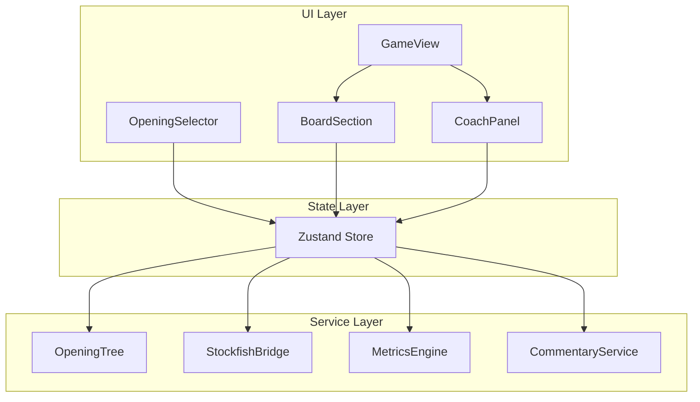

# OpeningIQ Implementation Plan

## Summary of Documents

**PRD (Product Requirements Document)** defines the product: a chess opening trainer for 800–1400 ELO players that teaches *why* moves work, not just *what* to play. Core features: opening selection (10 openings), live board vs Stockfish, theory-weighted engine responses, and a left-panel coach with move list, position metrics, and commentary.

**TDD (Technical Design Document)** specifies the architecture: fully client-side SPA, React 18 + Vite, chess.js, react-chessboard, Stockfish WASM, Zustand, Tailwind. Build sequence in 6 phases from foundation through full opening library.

---

## Architecture Overview




---

## Phase 1: Foundation

**Goal:** Vite + React project, chess.js, react-chessboard, legal moves, move history in state.

- Initialize Vite + React + TypeScript project
- Add dependencies: `chess.js`, `react-chessboard`, `zustand`, `tailwindcss`
- Create Zustand store with initial shape: `fen`, `history`, `phase`, `playerColor`, `engineThinking`
- Implement `BoardSection` with react-chessboard: click/drag move input, legal move highlighting, last-move highlight
- Wire board to store: on player move, validate with chess.js, update FEN and history
- Add dark theme via Tailwind
- Implement basic `MoveList` component (flat list, algebraic notation)

**Deliverable:** Playable board where you can make legal moves and see move history.

---

## Phase 2: Stockfish Integration

**Goal:** Stockfish WASM worker, bridge API, engine responds to moves.

- Add `stockfish.js` (or `stockfish.wasm` package) — ensure SharedArrayBuffer headers for deployment
- Create `stockfish.worker.js` that loads Stockfish and relays UCI messages
- Implement `StockfishBridge` class: `init()`, `getMove(fen, depth)`, `evaluate(fen)`
- Add `setElo(elo)` and `disableEloLimit()` for phase-specific behavior
- On player move: if engine's turn, call `getMove()`, apply move to board, update store
- Board locked during `engineThinking` to prevent input errors
- Add `GameControls`: ELO selector (800–2000, step 200), new game, flip board

**Deliverable:** Engine plays random legal moves in response; board locks during engine thinking.

---

## Phase 3: Opening Tree

**Goal:** One opening (Italian Game) in JSON, tree lookup, theory-weighted engine responses, phase transition.

- Create `/src/data/openings/` and JSON schema per TDD §3.1
- Implement Italian Game JSON with moves, FENs, commentary, `engineResponses`, `responseWeights`, `children`
- Implement `OpeningTree` class: `buildFenIndex()`, `getNode(fen)`, `sampleResponse(node)`
- Game flow: on engine turn during opening phase, use `OpeningTree.sampleResponse()` instead of Stockfish
- When `getNode(fen)` returns null → set `phase` to `"free"`, switch to Stockfish with ELO limit
- Store `openingId`, `openingNode` in Zustand
- Move list: show in-theory (white bg) vs deviation (amber bg) per move

**Deliverable:** Italian Game plays through theory; engine uses tree; phase switches to free play after theory ends.

---

## Phase 4: Metrics Engine

**Goal:** Four metrics implemented, dashboard with delta indicators and animations.

- Implement `MetricsEngine` pure functions (per TDD §6):
  - `pieceActivity(chess, color)` — count pseudo-legal moves
  - `centerControl(chess)` — attack count on d4, d5, e4, e5
  - `pawnStructure(chess, color)` — rule-based: doubled, isolated, chain, normal
  - `kingSafety(chess, color)` — open files near king + penalty score
- Add `MetricsDelta` shape and compute delta after each half-move
- Create `MetricsDashboard` with four `MetricCard` components
- Animate metric changes: green for improvement, red for deterioration (from player perspective)
- Wire metrics into store; recalculate on every move

**Deliverable:** Left panel shows live metrics with animated deltas.

---

## Phase 5: Commentary

**Goal:** Static commentary from opening JSON, LLM fallback for deviations, full coach panel.

- Wire `CommentaryService`: resolve from `openingNode.commentary` first, else call LLM
- Create Netlify/Vercel Edge Function `/api/commentary` (or `/netlify/functions/commentary.js`):
  - Accept `{ prompt }`, inject `OPENAI_API_KEY`, call gpt-4o-mini
  - Rate limit 30 req/min per IP (e.g. Upstash)
  - Return `{ text }`
- `Commentary` component: display current commentary, loading state if LLM > 500ms
- Implement `OpeningSummary` card: shown when phase → free; opening name, variation, centipawn score, evaluation paragraph
- Full `CoachPanel` layout: MoveList, MetricsDashboard, Commentary, OpeningSummary (conditional)

**Deliverable:** Commentary for mainline and deviations; opening summary on phase transition.

---

## Phase 6: Opening Library & Polish

**Goal:** All 10 openings, home screen selector, end-to-end flow.

- Create JSON files for all v1 openings (per PRD §3.1):
  - White: Italian, Ruy Lopez, London, Queen's Gambit
  - Black: King's Indian, Sicilian Najdorf, Caro-Kann, French, Pirc, Scandinavian
- Each with `moves`, FENs, pre-generated commentary, `engineResponses`, `responseWeights`
- Build `OpeningSelector` home screen: cards by style (aggressive/solid/positional) and color
- Card content: name, ECO, description, difficulty tag
- Routing: home → game on opening select; game → home on "new game" from home
- ELO selector in game; persist to store
- Add required headers for Stockfish WASM: `Cross-Origin-Opener-Policy`, `Cross-Origin-Embedder-Policy`
- Deploy to Netlify or Vercel; configure env vars

**Deliverable:** Full product with 10 openings, selector, and deployable build.

---

## Key Files & Structure

```
src/
├── main.tsx
├── App.tsx
├── components/
│   ├── OpeningSelector.tsx
│   ├── GameView.tsx
│   ├── BoardSection.tsx
│   ├── CoachPanel.tsx
│   ├── MoveList.tsx
│   ├── MetricsDashboard.tsx
│   ├── MetricCard.tsx
│   ├── Commentary.tsx
│   ├── OpeningSummary.tsx
│   └── GameControls.tsx
├── store/
│   └── gameStore.ts
├── services/
│   ├── StockfishBridge.ts
│   ├── OpeningTree.ts
│   ├── MetricsEngine.ts
│   └── CommentaryService.ts
├── workers/
│   └── stockfish.worker.js
├── data/
│   └── openings/
│       ├── italian-game.json
│       └── ... (9 more)
└── types/
    └── index.ts

netlify/functions/commentary.js   # or Vercel api/commentary.ts
```

---

## Testing Strategy (per TDD §10)

- **MetricsEngine:** Unit tests for each metric with known FENs
- **OpeningTree:** `buildFenIndex`, `getNode`, `sampleResponse` distribution
- **Integration:** Italian Game mainline → phase ends correctly; deviation → Stockfish free mode
- **Components:** MoveList, MetricsDashboard delta colors, OpeningSummary on phase change

---

## Performance Targets (per TDD §11)


| Constraint            | Target                       |
| --------------------- | ---------------------------- |
| Stockfish (opening)   | < 500ms                      |
| Stockfish (free play) | < 2000ms                     |
| Metrics calc          | < 10ms                       |
| Static commentary     | < 50ms                       |
| LLM commentary        | < 3000ms, loading if > 500ms |
| TTI                   | < 3s on 4G                   |
| Stockfish WASM        | < 6MB                        |


---

## Dependencies to Add

```json
{
  "chess.js": "^1.x",
  "react-chessboard": "^4.x",
  "zustand": "^4.x",
  "tailwindcss": "^3.x"
}
```

Stockfish: use `stockfish.js` (official WASM build) or `stockfish.wasm` npm package. LLM: OpenAI SDK in Edge Function only.

---

## Open Questions / Decisions

1. **Stockfish package:** `stockfish.js` (CDN script) vs `stockfish.wasm` npm — TDD references `/stockfish/stockfish.js`; may need to verify current best practice for Vite + Worker.
2. **Opening data source:** Pre-generated JSON for all 10 openings requires manual curation or tooling to extract from Lichess/Chess.com opening databases. Consider starting with 2–3 openings fully populated, then expand.
3. **LLM fallback when unavailable:** Graceful degradation — show "Commentary unavailable" or cached generic text when API fails or is rate-limited.

